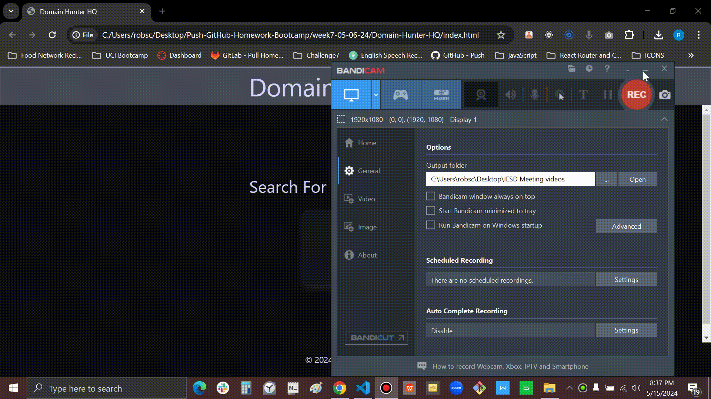

# Domain Hunter HQ

Choosing the right business name is challenging, and finding the right fit can be tough, especially when many desirable names are already taken. Our project utilizes WhoisXML API's tools to access global domain registration data, allowing users to quickly check if their desired business name is available. If the name is already taken, we'll provide you with information on the current owner. It's the ultimate tool for securing the perfect name for your business endeavor.

## User Story

```
AS A business owner
I WANT to see if a domain name is available
SO THAT I can register for it
```

## Acceptance Criteria

```
GIVEN a domain checker with form inputs

1. WHEN I enter a domain name to search
THEN I am presented whether the domain name is available or taken.

2. WHEN a domain is taken
THEN I am presented with how old the domain is and its registered owner's contact info.
```

## Demonstration



## Presentation


## Technologies Used

1. [Name Checker API](https://domain-availability.whoisxmlapi.com/api)
2. [Registration Checker API](https://whois.whoisxmlapi.com/)
3. HTML/CSS for structure and styling.
4. JavaScript for interactive elements.
5. Bulma: open-source CSS framework for modal card display of domain information.

## Link to the Deployed Web App

[Link to the deployed Domain Hunter HQ](https://girlnotfound.github.io/Domain-Hunter-HQ/)

## Collaborators

This project was made possible with the help of:

[Kaila R.](https://github.com/girlnotfound)

[Robert S.](https://github.com/robscafe433)

[Ryan P.](https://github.com/RyanPetersen-89)

[Truong N.](https://github.com/ngojohn2002)

## Project Roadmap

**Research and Planning:**

1. Research at least two server-side APIs.
2. Research CSS frameworks

**Repository Setup:**

1. Create and name GitHub repository.
2. Create repository file structure: add style.css and script.js files.
3. Add README file (complete with unique name, description, technologies used, screenshot, and link to deployed application).

**Frontend Development:**

1. Design responsive polished UI (i.e., accept and respond to user input).
2. Add modal so users can interact with application.

**Backend Development:**

1. Create feature to search for domain name availability.
2. Create feature to present domain's registrant info if domain name is taken.
3. Store persistent data in client-side storage.

**Testing and Deployment:**

1. Test and approve application.
2. Deploy application.

**Project Presentation Preparation:**

1. Prepare for app presentation using the project presentation template to address the following:

- Elevator pitch: A one-minute description of your application.
- Concept: User story and motivation for development.
- Process: Technologies used, task allocation, challenges, successes.
- Demo: Showcase your application.
- Directions for Future Development: Suggest other potential domain names and provide domain name hosting services.

&copy; 2024 - Domain Hunter HQ.
